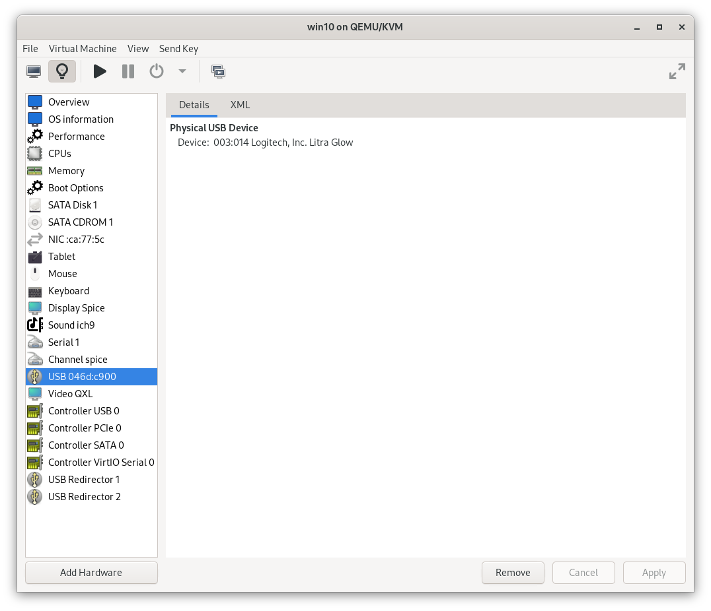

# Reverse Engineering Litra Glow USB device

I recently brought a
[Logitech Litra Glow](https://www.logitech.com/en-gb/products/lighting/litra-glow.946-000002.html)
USB streaming light. Logitech
[provide software](https://www.logitechg.com/en-gb/innovation/g-hub.html) to
control it from Windows or Mac, but not my prefered operating systems of Fedora
or Android. It is possible to control it via the buttons on the back but it's
awkward compared to on screen controls.

I wish to make an [app for Linux](https://github.com/ccouzens/Litra-Glow-GTK) to
let me control it. To do so I will need to know how to communicate with it over
USB. This blog post describe how I reverse engineered the protocol.

I am cheating. There is already an
[open source Linux app](https://github.com/kharyam/litra-driver) to control the
light. [The author](https://github.com/kharyam) reverse engineered
[the protocol](https://github.com/kharyam/litra-driver/blob/ab76bc90e483205b91c80e7849be65da61cfddd1/src/llgd/lib/llgd_lib.py#L82-L83)
before me. I have seen it and used it to verify I can write
[successful USB code](https://github.com/ccouzens/Litra-Glow-GTK/blob/1ce98de0b4e5b21eb80bac726fd277570b715d73/src/main.rs)
from Rust.

I am reverse engineering it myself as a learning experience. The intended
audience of this post is me in the future referring back on the steps I took.

The first half of [this video](https://www.youtube.com/watch?v=is9wVOKeIjQ) was
very helpful in providing the required background. The streamer explains some
USB background, demonstrates a technique of using a Windows Virtual Machine and
Wireshark to watch the USB traffic and what to look for in the Wireshark
capture.

## lsusb

Let's find the device using `lsusb`. I've grepped the output to keep it
focussed.

```bash
[chris@chris-inspirion ~]$ lsusb | grep 'Litra Glow'
Bus 003 Device 004: ID 046d:c900 Logitech, Inc. Litra Glow
```

This tells us 4 things.

1. The device is on my laptop's 3rd USB bus.
2. Within that bus, it is device 4. These 2 pieces of information identify the
   device on my laptop. I expect the values might change if the device is
   unplugged or the laptop is restarted.
3. The vendor id is 046d. This makes sense as it is the
   [vendor id of Logitech](https://devicehunt.com/view/type/usb/vendor/046D).
4. The product id is c900. All Litra Glows should have the same vendor id and
   product id. No other device should have this combination of ids (but it is
   good security practice to not assume all devices with this combination work
   the same was as my device).

The bus and device numbers may change throughout this post as I didn't write it
all at once.

Now let's get more detailed information about the device.

```bash
[chris@chris-inspirion ~]$ lsusb -d 046d:c900 -v

Bus 003 Device 004: ID 046d:c900 Logitech, Inc. Litra Glow
Device Descriptor:
  bLength                18
  bDescriptorType         1
  bcdUSB               1.10
  bDeviceClass            0
  bDeviceSubClass         0
  bDeviceProtocol         0
  bMaxPacketSize0        64
  idVendor           0x046d Logitech, Inc.
  idProduct          0xc900
  bcdDevice            1.00
  iManufacturer           1 Logi
  iProduct                2 Litra Glow
  iSerial                 3 **********
  bNumConfigurations      1
  Configuration Descriptor:
    bLength                 9
    bDescriptorType         2
    wTotalLength       0x0029
    bNumInterfaces          1
    bConfigurationValue     1
    iConfiguration          0
    bmAttributes         0x80
      (Bus Powered)
    MaxPower              500mA
    Interface Descriptor:
      bLength                 9
      bDescriptorType         4
      bInterfaceNumber        0
      bAlternateSetting       0
      bNumEndpoints           2
      bInterfaceClass         3 Human Interface Device
      bInterfaceSubClass      0
      bInterfaceProtocol      0
      iInterface              0
        HID Device Descriptor:
          bLength                 9
          bDescriptorType        33
          bcdHID               1.11
          bCountryCode            0 Not supported
          bNumDescriptors         1
          bDescriptorType        34 Report
          wDescriptorLength      89
         Report Descriptors:
           ** UNAVAILABLE **
      Endpoint Descriptor:
        bLength                 7
        bDescriptorType         5
        bEndpointAddress     0x82  EP 2 IN
        bmAttributes            3
          Transfer Type            Interrupt
          Synch Type               None
          Usage Type               Data
        wMaxPacketSize     0x0040  1x 64 bytes
        bInterval               1
      Endpoint Descriptor:
        bLength                 7
        bDescriptorType         5
        bEndpointAddress     0x02  EP 2 OUT
        bmAttributes            3
          Transfer Type            Interrupt
          Synch Type               None
          Usage Type               Data
        wMaxPacketSize     0x0040  1x 64 bytes
        bInterval               1
Device Status:     0x0080
  (Bus Powered)
```

I've replaced the serial number with stars.

We see that it has 2 endpoints. Both use Transfer Type Interrupt, but the first
(0x82) is IN and the 2nd (0x02) is OUT. This probably means it works using a
request response model initiated by my computer (like HTTP/1.0 initiated by the
browser).

## Virtual machine

We will use a virtual machine and Windows to run the Logitech software. I tried
running the software in Wine but it didn't work. I used
[virt-manager](https://virt-manager.org/) as the virtual machine. The streamer
of the youtube video used VirtualBox so that is also an option.

Install Windows into the virtual machine. Windows 10 worked better for me, but
Windows 11 may become an option later. I downloaded it through the
[Microsoft website](https://www.microsoft.com/en-gb/software-download/windows10ISO).
Make sure you're in compliance with their terms and conditions.

Add direct access to the USB device. In virt-manager you use
`Add Hardware 🡒 USB Host device`.



Install Logitech's software in Windows and verify it can control the hardware.

## Wireshark

We will use Wireshark to capture the USB traffic and to read it.

```bash
sudo tshark -i usbmon3 -w 07-litra-glow-capture
```

Unfortunately capture filters are not available for USB so we cannot filter at
this stage except for the USB bus.

Start the capture and make notes:

> 21:44:00 started capture
>
> 21:44:18 started wireshark
>
> 21:44:59 started windows
>
> 21:46:04 started logitech software
>
> 21:47:18 selected litra glow
>
> 21:47:35 turned on through the UI
>
> 21:47:53 turned off through the UI
>
> 21:48:14 turned on using the button
>
> 21:48:38 turned off using the button
>
> 21:49:03 shut down windows
>
> 21:49:39 stop the capture

We can now load the capture using Wireshark for analysis. After loading apply
the display filter `usb.device_address == 4`.

Other [USB display filters](https://www.wireshark.org/docs/dfref/u/usb.html) are
available. I did not have success with `usb.idProduct` or `usb.idVendor`,
perhaps because once the device has been identified these are not sent.

When starting Windows I see a lot of fetching meta information like is shown by
`lsusb`. I see a little of this when starting the capture (6 packets), but a lot
more when Windows starts (44 packets).

Packets with HID Data seem to be the useful ones, so we can modify our filter
further: `usb.device_address == 4 && usbhid.data`.

I observe that the messages are almost all `out` (host source) followed `in`
(3.4.2 source). The exception is when I used the buttons on the device.

I experimented to see if I could write a program to capture button presses.
[I can](https://github.com/ccouzens/Litra-Glow-GTK/blob/65804b791db3827bed735b7e24b59c012eff3edc/src/bin/watch.rs):

```rust
const VENDOR_ID: u16 = 0x046d;
const PRODUCT_ID: u16 = 0xc900;

fn main() {
    let api = hidapi::HidApi::new().unwrap();

    let device = api.open(VENDOR_ID, PRODUCT_ID).unwrap();

    let mut buf = vec![0; 20];

    loop {
        let len = device.read(&mut buf).unwrap();

        println!(
            "{} {}",
            chrono::Local::now().format("%H:%M:%S"),
            &buf[0..len]
                .iter()
                .map(|n| format!("{:02x}", n))
                .collect::<Vec<String>>()
                .join(":")
        );
    }
}
```

I initially used the hexdump crate to format the buffer. I swapped to my own
formatter as I think it is clearer to have everything on one line.

Run the program and make notes:

```
Turn on
11:ff:04:00:01:00:00:00:00:00:00:00:00:00:00:00:00:00:00:00
Brightness down
11:ff:04:10:00:1c:00:00:00:00:00:00:00:00:00:00:00:00:00:00
Brightness up
11:ff:04:10:00:38:00:00:00:00:00:00:00:00:00:00:00:00:00:00
11:ff:04:10:00:54:00:00:00:00:00:00:00:00:00:00:00:00:00:00
11:ff:04:10:00:94:00:00:00:00:00:00:00:00:00:00:00:00:00:00
11:ff:04:10:00:fa:00:00:00:00:00:00:00:00:00:00:00:00:00:00
Colour down
Colour up
11:ff:04:20:13:88:00:00:00:00:00:00:00:00:00:00:00:00:00:00
11:ff:04:20:11:94:00:00:00:00:00:00:00:00:00:00:00:00:00:00
11:ff:04:20:0d:48:00:00:00:00:00:00:00:00:00:00:00:00:00:00
11:ff:04:20:0a:8c:00:00:00:00:00:00:00:00:00:00:00:00:00:00
Colour down
11:ff:04:20:0d:48:00:00:00:00:00:00:00:00:00:00:00:00:00:00
11:ff:04:20:11:94:00:00:00:00:00:00:00:00:00:00:00:00:00:00
11:ff:04:20:13:88:00:00:00:00:00:00:00:00:00:00:00:00:00:00
11:ff:04:20:19:64:00:00:00:00:00:00:00:00:00:00:00:00:00:00
Brightness down
11:ff:04:10:00:94:00:00:00:00:00:00:00:00:00:00:00:00:00:00
11:ff:04:10:00:54:00:00:00:00:00:00:00:00:00:00:00:00:00:00
11:ff:04:10:00:38:00:00:00:00:00:00:00:00:00:00:00:00:00:00
11:ff:04:10:00:1c:00:00:00:00:00:00:00:00:00:00:00:00:00:00
Off
11:ff:04:00:00:00:00:00:00:00:00:00:00:00:00:00:00:00:00:00
```

Organised a bit:

```
Turn on
11:ff:04:00:01:00:00:00:00:00:00:00:00:00:00:00:00:00:00:00
Turn Off
11:ff:04:00:00:00:00:00:00:00:00:00:00:00:00:00:00:00:00:00

Brightness ascending
11:ff:04:10:00:1c:00:00:00:00:00:00:00:00:00:00:00:00:00:00
11:ff:04:10:00:38:00:00:00:00:00:00:00:00:00:00:00:00:00:00
11:ff:04:10:00:54:00:00:00:00:00:00:00:00:00:00:00:00:00:00
11:ff:04:10:00:94:00:00:00:00:00:00:00:00:00:00:00:00:00:00
11:ff:04:10:00:fa:00:00:00:00:00:00:00:00:00:00:00:00:00:00

Colour ascending
11:ff:04:20:19:64:00:00:00:00:00:00:00:00:00:00:00:00:00:00
11:ff:04:20:13:88:00:00:00:00:00:00:00:00:00:00:00:00:00:00
11:ff:04:20:11:94:00:00:00:00:00:00:00:00:00:00:00:00:00:00
11:ff:04:20:0d:48:00:00:00:00:00:00:00:00:00:00:00:00:00:00
11:ff:04:20:0a:8c:00:00:00:00:00:00:00:00:00:00:00:00:00:00
```

I wrote
[a program to test writing to the device](https://github.com/ccouzens/Litra-Glow-GTK/blob/633787bb1c56747c3bd4f0406a639d851d7d085f/src/bin/control.rs).

Using this, my existing capture and additional captures I observe the following:

```
Turn on
11:ff:04:1a:01:00:00:00:00:00:00:00:00:00:00:00:00:00:00:00
Turn off
11:ff:04:1a:00:00:00:00:00:00:00:00:00:00:00:00:00:00:00:00
lowest brightness setting
11:ff:04:4d:00:14:00:00:00:00:00:00:00:00:00:00:00:00:00:00
highest brightness setting
11:ff:04:4d:00:fa:00:00:00:00:00:00:00:00:00:00:00:00:00:00
coolest colour
11:ff:04:9d:19:64:00:00:00:00:00:00:00:00:00:00:00:00:00:00
warmest colour
11:ff:04:9d:0a:8c:00:00:00:00:00:00:00:00:00:00:00:00:00:00
```

It is worth noting that the top button on the colour decreases the value. In
between values are possible for controlling warmness, but the majority do not
seem to change the colour. More investigation is needed here.
